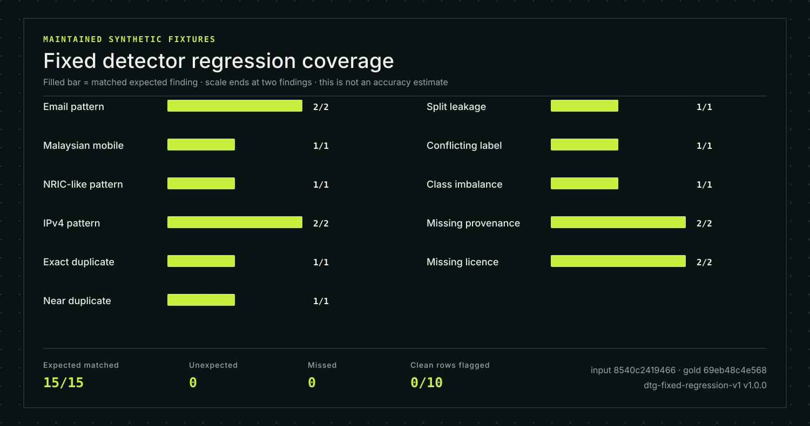

## DataTrust Gate: a bounded PII and governance checker for release datasets

This tool checks local CSV or JSON files (flat, no nested trees) and outputs one of
three decisions — `BLOCK`, `WARN`, or `PASS` — along with masked evidence,
suggested remediation steps, reproducible content hashes, and downloadable JSON and
Markdown result files. The application is deliberately simple: it runs in the browser,
parsing and evaluating the input file without uploading data anywhere; only a fixed‑size JSON payload (no raw rows) leaves the client and lands in `/api/audit` on the same host, where it is stored temporarily just long enough to be processed.

The detector rules are intentionally narrow: Email and Malaysian NRIC patterns, NRIC-adjacent mobile numbers, IPv4 literals, exact record duplicates, near-duplicates by token Jaccard similarity, same-record content across splits, identical feature vectors paired with different labels, class imbalance, missing or unverifiable license/provenance metadata.

This is a student prototype. I did not build it for any organization, certification, or legal
claim — just as an experiment to demonstrate where data might leak PII or violate
governance boundaries before training. It is not endorsed by nor affiliated with the Sarawak
Artificial Intelligence Centre, MOSTI, NIST, W3C, or the ICO. Those external references are cited only for context:

- [NIST AI Resource Center](https://airc.nist.gov/) has material on testing, evaluation, verification and validation of ML models;
- Malaysia's [National Guidelines on AI Governance and Ethics](https://www.mosti.gov.my/wp-content/uploads/2024/09/NATIONAL-GUIDELINES-OF-AIGE-20241118.pdf) emphasises privacy safeguards, transparency, reproducibility and accountability;
- The [W3C Data Quality Vocabulary](https://www.w3.org/TR/vocab-dqv/) gives a pattern for recording data-quality observations; and
- [ICO pseudonymisation guidance](https://ico.org.uk/for-organisations/uk-gdpr-guidance-and-resources/data-sharing/anonymisation/pseudonymisation/) distinguishes masking from anonymisation and flags residual re‑identification risk.

"Informed by" here is plain — I looked at those sources when defining the scope. They are not certification or legal obligations for this tool.

## Implemented checks

| Detector | Decision | Evidence returned |
|---|---|---|
| Email, Malaysian mobile, NRIC-like, and IPv4 patterns | `BLOCK` | Row, column, category, and a redaction marker—never the matched value |
| Exact duplicates after excluding the configured ID | `WARN` | Record pair locations |
| Near duplicates using deterministic token Jaccard similarity | `WARN` | Record pairs and similarity percentage; no source text |
| Identical records crossing configured dataset splits | `BLOCK` | Record pair locations; scalar split values are withheld |
| Identical features with conflicting labels | `BLOCK` | Record group locations and label count |
| Material class imbalance | `WARN` | Largest and smallest observed class share |
| Missing provenance | `BLOCK` | Metadata finding |
| Missing license or documented permission basis | `BLOCK` | Metadata finding |

Regex, rule, and statistical checks can produce both false positives and false negatives. They do not determine consent, ownership, fairness, representativeness, fitness for purpose, or legal compliance.

## Privacy and storage boundary notes

- The selected file is parsed in the browser. Raw file text is not uploaded as a file or stored by the application.
- Parsed rows remain in React memory until the user clears them, replaces them, navigates away, or closes the page.
- A bounded JSON request is sent only to the same-origin `/api/audit` route. The route copies streamed bytes into one fixed-size buffer and stops reading once the cap is exceeded, so tiny chunk counts cannot amplify retained request memory. The server has no outbound model or analytics call.
- The route holds the request body and parsed rows only for the request lifetime. It does not write them to D1, R2, browser storage, logs, or repository artifacts.
- `.openai/hosting.json` leaves both `d1` and `r2` bindings `null`.
- API responses use `Cache-Control: no-store` and omit every raw row scalar value, not only matched identifiers. Label distributions use neutral category tokens, and split values are withheld from evidence.
- Release metadata is intentionally preserved in the JSON report. In the Markdown card, ASCII punctuation and URL delimiters are entity-encoded so operator text cannot create active links, images, or HTML. Do not put raw rows, personal data, credentials, or secrets in metadata fields.
- A deterministic dataset hash is returned for reproducibility. A hash can still support a confirmation attack against guessable content; it is not anonymisation.

Enforced limits:

| Boundary | Limit |
|---|---:|
| Local file | 1,000,000 bytes |
| API request | 1,500,000 bytes |
| Rows | 1,000 |
| Columns | 40 |
| Column name | 128 characters |
| Scalar cell | 4,096 characters |
| Metadata field | 500 characters |
| Near-duplicate pair comparisons | 50,000 |
| Near-duplicate token matches | 64 per row |

See [docs/PRIVACY.md](docs/PRIVACY.md) for the lifecycle, tested egress paths, and residual risks.

## Fixed detector regression suite



The figure is generated from the maintained synthetic fixture suite. A filled
bar means the detector matched a separately declared expected finding; it does
not represent measured precision, recall, robustness, or coverage of real
datasets. The clean control and unexpected/missed counts are shown separately
so a matched finding cannot hide an extra or absent result.

The repository includes fixed synthetic detector-regression fixtures with a clean control, isolated single-fault cases, and a compound-fault case. Expected findings are declared separately from scanner inputs. The suite checks whether maintained examples still trigger the intended rules; it is not a measured accuracy benchmark.

Reproduce it:

```bash
npm run regression
npm run regression -- --json
```

Regenerate the SVG with `npm run evidence:render`. `npm run check` includes
`npm run evidence:check` and fails when the committed figure no longer matches
the fixed suite.

The implementation and expected findings are in [lib/regression-suite.ts](lib/regression-suite.ts); exact assertions are in [tests/audit.test.ts](tests/audit.test.ts).

Current `dtg-fixed-regression-v1` (`1.0.0`) result:

| Field | Value |
|---|---:|
| Expected findings matched | `15 / 15` |
| Unexpected findings | `0` |
| Missed expected findings | `0` |
| Clean rows flagged | `0 / 10` |
| Input artifact SHA-256 | `8540c2419466b995f739d1be59ab6d45fb4236e306a42f25e8c70894a1587560` |
| Gold artifact SHA-256 | `69eb48c4e56818fa636c41a6e83a4effd2c463176df40c5dcad88640d4db4dd4` |

These results describe only the maintained synthetic examples. They are not evidence of precision, recall, field accuracy, robustness on unseen formats, multilingual coverage, or organisational readiness. No deployment acceptance threshold is claimed.

## Run locally

Requirements: Node.js 22.13 or newer, npm.

```bash
npm ci
npm run dev
```

The application contains a “known-defect demo” that uses only synthetic values and intentionally omits provenance and license metadata.

## Verify

```bash
npm run check
```

The check runs ESLint, TypeScript, 16 detector/parser/report unit tests, a production vinext/Cloudflare Worker build, and six server-render/API integration tests. GitHub Actions also runs the same command against Node.js 22 in CI.

## Architecture

```text
CSV / JSON file
      |
      v
bounded browser parser ---- schema/count display
      |
      | same-origin JSON; parsed rows only
      v
POST /api/audit ---- request validation ---- deterministic detectors
                                              |      |      |
                                              PII   integrity   governance
                                                      |
                                                      v
                    masked findings + hashes + fixed regression suite
                                                      |
                                                      v
                               downloadable JSON / Markdown data card

No D1 · No R2 · No localStorage · No outbound model/API call
```

See [docs/ARCHITECTURE.md](docs/ARCHITECTURE.md) for detector contracts and hashing boundaries.

## Non-goals

- legal, privacy, security, or AI-governance certification;
- automatic release approval without accountable human review;
- detection of every identifier format or sensitive attribute;
- semantic duplicate detection across languages or paraphrases;
- durable uploads, accounts, team workflows, or dataset hosting;
- model training, fairness certification, or downstream performance prediction.

## License

[MIT](LICENSE)
